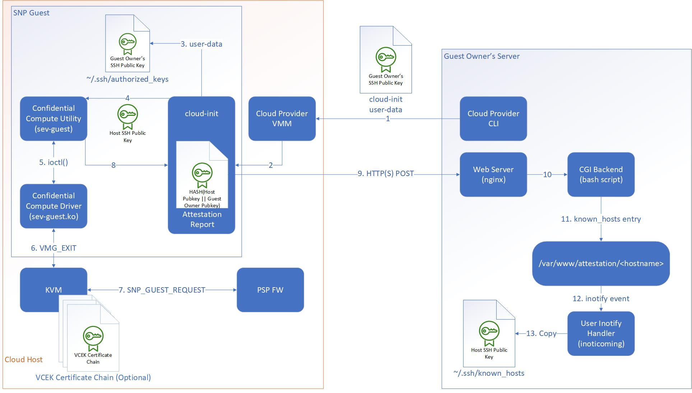

# SEV-SNP Attestation Example

This repository contains source, scripts, and configuration files for several open source tools that can be used together to demonstrate one way to perform remote attestation of SEV-SNP guests.

Note that these materials are intended for educational use only and come with no guarantee of fitness for any purpose.

---

## Architectural Overview
### Problem Statement
In this example, a Guest Owner will request a new guest instance from a remote cloud provider. The Guest Owner wishes to confirm the identity of the guest instance before sending any sensitive information to the guest. The guest instance will be protected by SEV-SNP, and the Guest Owner will confirm the identity of the guest using the SNP guest report. Once the identity of the guest is confirmed, the Guest Owner will exchange public keys with the guest instance to setup a secure channel for communication via ssh.

### Component Descriptions

The following diagram shows the high-level component relationships:

[design]: docs/images/remote-attestation-design.jpg "Remote Attestation Design"

Cloud Provider CLI/VMM
: This component includes the user interface to the Cloud Provider's infrastructure as well as the backend virtual machine manager that is responsible for launching guest images.
: This example assumes a CLI/VMM implementation that is capable of starting SEV-SNP guests.

cloud-init
: [cloud-init](https://github.com/canonical/cloud-init) is a tool common to multiple cloud vendors and is used to configure aspects of cloud instances such as networking, user creation, package installation, SSH key exchange, etc. The final instance configuration is comprised of metadata from the cloud provider, optional user data, and optional vendor data.
: This example provides a user data file that uses the `runcmd` module to initiate the attestation flow with a server controlled by the Guest Owner.

Confidential Compute Utility
: This utility communicates with the Confidential Compute Driver to retrieve the SNP guest report.
: This example provides the `sev-guest` utility in this repository to communicate with the proposed `sevguest.ko` Linux kernel module.

Confidential Compute Driver
: This guest kernel driver is responsible for sending the `SNP_GUEST_REQUEST` message to the ASP firmware and presenting the reply back to user space.
: This example will use the proposed `sevguest.ko` Linux kernel module.

Kernel Virtual Machine (KVM)
: [KVM](https://www.linux-kvm.org/page/Main_Page) is the kernel-mode component of the KVM-Qemu hypervisor on Linux and makes use of the virtualization instructions of modern x86 processors.
: This example makes use of the proposed SEV-SNP support in the `kvm_amd.ko` and `ccp.ko` Linux kernel modules. The `ccp.ko` module can optionally store the VCEK certificate for the platform along with the certificate chain necessary to validate the VCEK certificate. These certificates can be stored by the cloud provider using the `sev-host` utility in this repository.

AMD Secure Processor (ASP)
: The ASP is an embedded security subsystem in every AMD CPU and performs key management for SEV-SNP guests.
: This example will send the `MSG_REPORT_REQ` message to the ASP firmware to request a guest attestation report signed by the Versioned Chip Endorsement Key (VCEK).
: The Guest Owner can retrieve the certificate chain necessary to validate the attestation report signature directly from [AMD](https://developer.amd.com/wp-content/resources/ask_ark_milan.cert).
: Similarly, the Guest Owner can retrieve the VCEK certificate of the hosting platform directly from AMD using information contained in the attestation report.

Web Server
: The web server is controlled by the Guest Owner and listens for connections from new SEV-SNP guest instances. Any `POST` commands will be relayed to the CGI backend for processing.
: This example will have the SEV-SNP guest send a `POST` command containing the attestation report to an [nginx](http://nginx.org/en/) web server in the Guest Owner's infrastructure.

CGI Backend
: A scripting facility to process incoming requests to the web server.
: This example will use a simple `bash` script to receive the attestation report and verify the signature.

World-Readable Directory
: A directory on the web server that contains cached attestation results in the form of SSH `known_hosts` file entries. This directory is readable by any user on the system, and users can subscribe to any directory updates using `inotify`.
: While the CGI Backend could conceivably update the SSH `known_hosts` file for a user directly, doing so would require the CGI Backend to have elevated privileges on the web server and pose a potential security risk. Allowing users to subscribe to filesystem updates allows the CGI Backend to run with minimal privileges.
: This example uses `/var/www/attestation` to contain the SSH `known_hosts` entries for SEV-SNP guests that successfully attest. The files in this directory are named after the hostname of the guest.

User inotify Handler
: The `inotify` handler allows any user to subscribe to updates to the World-Readable Directory and run arbitrary commands whenever a new guest successfully attests to the Web Server.
: This example will use [inoticoming](https://packages.debian.org/sid/inoticoming) to monitor `/var/www/attestation` and copy any new guest `known_hosts` entries to the user's SSH `known_hosts` file.

### Attestation Flow

A complete SEV-SNP guest launch with attestation includes the following steps (as depicted in the [design] diagram):

1. The Guest Owner launches a new SEV-SNP guest instance and specifies their SSH public key in the `cloud-init` user data along with a list of shell commands necessary to perform the attestation. (See step XXX below.)
2. The cloud provider launches the guest and passes the instance configuration and user data to `cloud-init`.
3. `cloud-init` creates any new users and copies the Guest Owner's SSH public key to the new users' SSH `authorized_keys` file.
4. `cloud-init` generates SSH host keypairs to identify the guest and invokes the list of shell commands in the instance user data. These commands begin by passing the public portion of the host SSH key to the `sev-guest` utility along with the Guest Owner's public key for inclusion in the attestation report.
5. The `sev-guest` utility issues the `SNP_GET_REPORT` (or `SNP_GET_EXT_REPORT`) IOCTL to the `sevguest.ko` kernel driver to retrieve the attestation report from the ASP firmware. 
6. The `sevguest.ko` kernel driver encrypts and integrity-protects the `MSG_REPORT_REQ` guest message with a key that was placed into guest memory by the ASP during launch, then exits to the hypervisor. The key is known only to the guest and the ASP firmware, so the hypervisor cannot view or modify the guest message in transit.
7. The hypervisor sends the `SNP_GUEST_REQUEST` command (with the `MSG_REPORT_REQ` payload) to the ASP firmware.
8. The hypervisor relays the response back through the `sevguest.ko` driver, and the `sev-guest` utility returns the attestation report to `cloud-init`.
9. `cloud-init` continues executing the shell commands from the instance user data, which then `POST` the attestation report to the Guest Owner's Web Server.
10. The Web Server passes the attestation report to the CGI Backend for validation.
11. The CGI Backend validates the attestation report and, if successful, crafts an SSH `known_hosts` entry for the guest and writes it to a file in `/var/www/attestation/`.
12. Users who are monitoring `/var/www/attestation/` receive an `inotify` event that a new guest has successfully attested to the Web Server.
13. The user's `inotify` handler runs a script to copy the SSH `known_hosts` entry of the guest to the user's local `known_hosts` file.

At this point, the SSH key exchange is complete, and the Guest Owner can ssh to the guest with increased assurance that the guest is authentic and not an imposter. (For a discussion of the level of assurance provided to the Guest Owner, see [Security Considerations](#security-considerations) below.)

---

## Security Considerations
### Threat Model

SEV-SNP features a stronger threat model than past SEV features.

Trusted components:

 * AMD hardware and signed firmware,
 * OS software inside the target VM.

Untrusted components:

 * Everything else (including other VMs),
 * External devices.

Untrusted components are assumed to be malicious and may be conspiring with each other.

### Cloud-init user-data integrity

Since our threat model considers all cloud-provider infrastructure to be untrusted, it must be noted that the user-data provided to cloud-init has no integrity protection. Thus, it is possible for a malicious actor to alter the guest configuration, run arbitrary commands, or prevent key commands from running. One way to address this is to perform the attestation flow in this example earlier in the boot process, such as in the initrd, and make use of a measured boot scheme to protect the initrd. Future examples in this repository will demonstrate this approach. See [Future Work](#future-work) below.

### Identity
In this example, the Guest Owner verifies the SNP attestation report with the following series of checks:

 * The signature of the report verifies correctly using the public portion of the VCEK.
 * The signature of the VCEK verifies correctly using the public portion of the AMD Signing Key (ASK).
 * The signature of the ASK verifies correctly using the public portion of the AMD Root Key (ARK).
 * The ARK is self-signed.
 * The hash of the public keys included in the attestation report matches the expected value.

In the SEV-SNP architecture, the identity of the guest instance is established by the ID Block, which contains the public portion of a key pair that identifies the Guest Owner. This key is called the ID key. The ID block also contains the expected launch measurement of the guest instance. This ID block is copied into guest memory by the SEV-SNP firmware during the launch sequence and binds the Guest Owner's identity to that guest instance. If the ID block is present for a guest instance, then the attestation report generated by the SEV-SNP firmware will contain the hash of the ID key as well as the expected launch measurement. In this way, the attestation report attests to both the identity of the guest instance as well as the launch integrity.

This example does not yet configure the ID block when launching the guest, so the ID key and the launch measurement are currently set to 0 in the attestation report. As such, they are not checked by the Guest Owner. To realize the full security promise of SEV-SNP, production environments must configure these fields during launch. Similarly, Guest Owners should validate these fields in the attestation report in addition to the checks listed above. Future updates to this repository will demonstrate how to do this. See [Future Work](#future-work) below.

### Disk Image Protection

While SEV-SNP provides strong confidentiality and integrity guarantees for data in use, these protections do not extend to data at rest. Specifically, the virtual disk that contains the guest's root filesystem is typically implemented as a file under the control of the hypervisor. Since the hypervisor is untrusted in this example, a complete solution would include an encrypted disk image to protect the confidentiality of the filesystem. Future examples in this repository will demonstrate how to use the attestation flow to setup a secure communication channel early in the guest boot sequence and receive the key to unlock an encrypted disk. See [Future Work](#future-work) below.

---

## Future Work

Future updates to this repository will include additional examples of how to perform the following tasks:

 * Construct the ID Block for the SNP guest, (Done. Documentation pending. See `sev-host-identity --help` for more information.)
 * Verify the ID Block in the attestation report, (in progress)
 * Shift the attestation flow to the initrd and receive a disk encryption key. (Done. Documentation pending. See [attestation/cryptsetup-initramfs](attestation/cryptsetup-initramfs))

---

## Example Setup

Installation instructions for the cloud host and the Guest Owner infrastructure are outlined below. Note that for simplicity, these two servers can be the same physical machine.

 * [Cloud Host Setup](docs/cloud-host-setup.md)
 * [Guest Owner Setup](docs/guest-owner-setup.md)

---

## Resources

1. [AMD SEV-SNP ABI Specification (PDF)](https://www.amd.com/system/files/TechDocs/56860.pdf)
2. [AMD Signing Key (ASK) and AMD Root Key (ARK) Certificates for Milan Processors](https://developer.amd.com/wp-content/resources/ask_ark_milan.cert)

